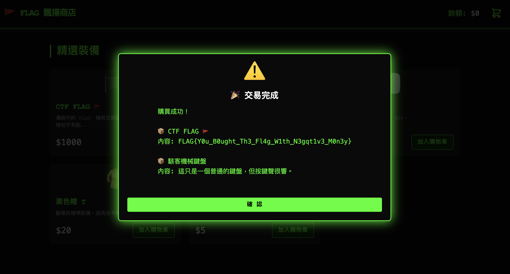

# 飄揚商店 (Flag Shop)

## Metadata
- **CTF**: Cybersecurity Easy to Learn (ch1_easy-chall)
- **Category**: Web / Logic Flaw
- **Points**: Easy
- **題目描述**: 這是一個入門級的 Web CTF 挑戰，目標是找出隱藏在商店中的 Flag。

---

## TL;DR

這題核心考驗對購物車邏輯漏洞（CWE-1284）的理解。只要趁著前端能任意更改商品數量的漏洞，買一個超高價的 Flag，再加上數量為極大負數的便宜商品，就能讓結帳總金額變成 0，藉此繞過系統的餘額檢查，不花一毛錢把 Flag 買下來。

---

## 初步觀察

進到題目網頁，外觀就像是個普通的線上商店。目標很明確：我們要把那個超出我們帳戶餘額的 Flag 商品買下來。稍微看了一下初始狀態，我們身上的餘額只有 $100，但 Flag 的標價卻高達 $1,000。直覺告訴我這大概是某種邏輯漏洞，或者是必須去竄改前端傳送的參數來變更價格。

---

## 死路與折返

剛開始我在看前端原始碼時，在 `utils/crypto.js` 看到一段混淆得很誇張的加解密函式（像是 `_0x5a1b` 這種奇怪的命名），想說該不會 Flag 就藏在某個靜態檔案裡，等著我去逆向破解它？這想法浪費了我一點時間，後來意識到就算逆向出演算法，沒有金鑰也是白搭。原來這只是單純用來保護 Flag 不被直接從原始碼搜出來，只要順利完成「購買」，系統就會自動幫我們解密。

另外一個陷阱是輸入框的前端驗證。我試著在網頁的數量欄位打上負數，想看看有什麼反應，結果 UI 畫面直接跳出「❌ 輸入錯誤：數量不能為小數！」完全不讓我點結帳。當下我還以為數量檢驗做得很完善，正準備轉移目標去找 SQL injection 或是 XSS 的時候，才猛然發覺：等一下，這只是在攔截 UI 輸入的前端防護而已啊！

---

## 解題過程

### 分析購物車邏輯

為了釐清這個商店底層到底是怎麼運算的，我打開瀏覽器的開發者工具（F12）仔細看了一遍 `assets/js/store.js`。裡面的 `checkout()` 函式馬上吸引了我的注意：

```javascript
checkout() {
    const total = this.cartTotal;
    
    // 檢查 1: 總金額不能小於 0
    if (total < 0) { ... return { success: false }; }

    // 檢查 2: 餘額不足
    if (total > this.state.balance) { ... return { success: false }; }

    // 扣款並解密
    this.state.balance -= total;
    ...
}
```

這個結帳邏輯看來算是中規中矩，它防禦了總額小於 0 的情況（所以不能單純只買一個數量是負數的東西來讓系統倒貼錢），也同時防了餘額不足。

---

## 關鍵突破

盯著那段 `checkout` 程式碼，我突然察覺到一個盲點：雖然它會擋下 `total < 0`，但如果我**同時買兩件不同的商品**呢？
這題算錢的方式是把每個項目的 `price * qty` 累加起來變成 `cartTotal`。
假如我把高價 Flag 的數量設為 1，然後找另一個超便宜的商品，把它的數量設定成**極大的負數**，只要這兩者的價格互相抵銷，讓結帳總金額剛好變成 $0（或是稍微小於 $100 的正數），這不就完美避開了 `total < 0` 跟 `total > balance` 這兩個防線了嗎！

---

## Exploit / Payload

```javascript
// 執行環境：瀏覽器開發者工具 (Console)

// 1. 為了確保計算準確，先把購物車清空
store.state.cart = [];

// 2. 把目標物 Flag (假設 ID 為 4，價格 $1000) 加進購物車
store.addToCart(4);

// 3. 找一個最便宜的干擾項 (假設 ID 為 1，價格 $10) 加進購物車
store.addToCart(1);

// 4. 計算需要的負數量：
// 目標是讓總金額 = 0
// 1000000 * 1 + 10 * x = 0  => x = -1000
// 在這裡直接呼叫核心方法，繞過 UI 的輸入框限制
store.updateCartItemQty(1, -1000);

// 5. 這樣帳單總額就變成 0 了，直接觸發結帳！
store.checkout();
```

這段腳本可以直接貼在 Console 裡執行，因為開發者為了除錯方便，把 `store` 物件整個綁到了 `window.store` 上面，等於是大門敞開讓我們隨意呼叫內部功能。

---

## Flag



```
FLAG{Y0u_B0ught_Th3_Fl4g_W1th_N3gqt1v3_M0n3y}
```

---

## Pattern Card

**這題教了什麼：**

- **前提條件**：系統允許商品數量為負值（通常是因為只做了前端防護，而後端或核心邏輯沒有再次驗證），並且結帳時允許多個商品並存，產生價格互相抵銷的效果。
- **嗅覺線索**：看到購物車有前端的攔截提示，或是攔截 API 請求後發現可以隨意竄改數量參數時，第一時間可以試著送出 `-1` 或是字串、浮點數等意料之外的格式來戳戳看。
- **現實意義**：這對應到真實世界的安全問題 [CWE-1284: Improper Validation of Specified Quantity in Input](https://cwe.mitre.org/data/definitions/1284.html)。電商平台的購物車如果沒有在伺服器端嚴格要求 `qty > 0`，且沒有確保每項商品的小計都不為負數，惡意使用者就能用類似手法買走高價商品甚至「洗錢」。正確的做法應該是在 `updateCartItemQty` 這類層級直接拒絕並拋出例外（throw error）。

---

## References

- [CWE-1284: Improper Validation of Specified Quantity in Input](https://cwe.mitre.org/data/definitions/1284.html)
